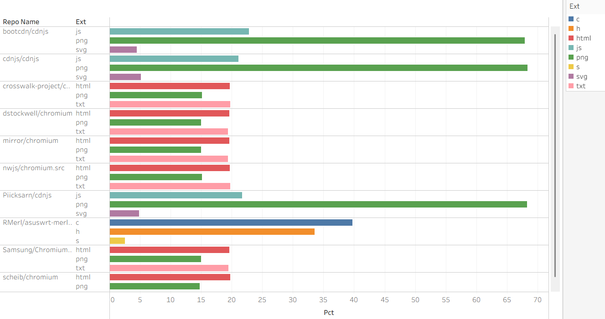
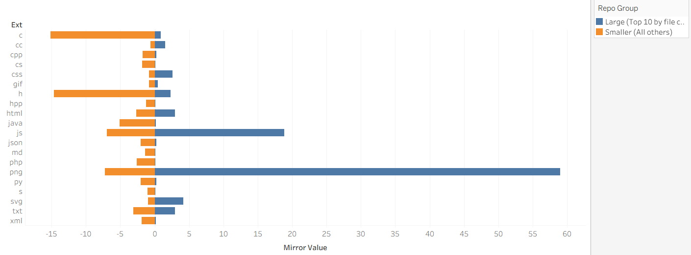

# GitHub Repository File-Type Analysis
This project analyzes file-type distributions across GitHub repositories, with a focus on repositories classified as large by file count.  
By examining both the internal composition of large repositories and comparing them with smaller repositories, 
the analysis reveals that large repositories tend to concentrate on a limited set of file types—often related to web development
and resource distribution—while smaller repositories exhibit more diverse file structures. 
The results highlight how repository size is closely associated with structural organization and project purpose rather than simply reflecting scale alone.

## Project Overview / プロジェクト概要
This project uses the public GitHub Activity (`github_repos`) dataset in Google BigQuery to demonstrate practical SQL analytics skills. 
The analysis explores repository structures, file distributions, and development patterns using real-world, large-scale data.  

本プロジェクトでは、**Google BigQuery** の公開データセット**GitHub Activity（`github_repos`）** を使用し、  
実務レベルの **SQL 分析スキル** を示すことを目的としています。
大規模な実データを対象に、リポジトリ構造・ファイル分布・開発パターンを分析しました。

---

## Objectives / 目的
The goals of this project are to:

- Explore a large public dataset using SQL
- Practice analytical SQL patterns used in real data roles
- Demonstrate proficiency in:
  - JOINs
  - Aggregations
  - Window Functions
  - Regular Expressions
- Translate raw data into meaningful insights  


本プロジェクトの目的は以下の通りです。
-  大規模な公開データを SQL で探索・分析する
- 実務で使用される分析クエリの練習
- 以下の SQL スキルを実証する：
  - JOIN
  - 集計（Aggregation）
  - Window Function
  - 正規表現（Regular Expressions）
- 生データから意味のあるインサイトを導き出す
  
---

## Dataset / データセット
- **Source**: Google BigQuery Public Datasets
- **Dataset**: `bigquery-public-data.github_repos`
- **Main tables used**:
  - `sample_files`
  - `commits`
  - `languages` *(optional)*

> Note: This dataset contains metadata from millions of public GitHub repositories
and is queried directly in BigQuery (no local download required).  

- **提供元**：Google BigQuery Public Datasets
- **データセット**：`bigquery-public-data.github_repos`
- **主に使用したテーブル**：
  - `sample_files`
  - `commits`
  - `languages`（必要に応じて）  
> 本データセットは数百万件の公開 GitHub リポジトリのメタデータを含み、BigQuery 上で直接クエリ可能です
（ローカルへのダウンロードは不要）。
---

## Analysis Tasks / 分析內容

This project investigates the following questions:

- What file types are most frequently used in large GitHub repositories defined by file count?
- How does file-type composition differ between large and small GitHub repositories?
- Do the largest GitHub repositories share similar file-composition patterns, or do notable outliers exist?
- What do file-type distributions reveal about the technologies and purposes of large GitHub repositories?

In this project, **large GitHub repositories** are defined as repositories with a high number of files.
Specifically, they refer to the **top 10 repositories ranked by total file count** in the dataset.
This definition focuses on repository size in terms of codebase and file structure, rather than popularity metrics such as stars or forks.  

本プロジェクトでは、以下の観点から分析を行いました。

- ファイル数によって定義された大規模な GitHub リポジトリでは、どのようなファイルタイプが多く使われているのか。
- 大規模リポジトリと小規模リポジトリの間で、ファイルタイプの構成はどのように異なるのか。
- ファイル数が最も多い GitHub リポジトリは、類似したファイル構成パターンを共有しているのか。それとも、顕著な例外（アウトライア）は存在するのか。
- ファイルタイプの分布から、大規模な GitHub リポジトリに用いられている技術やプロジェクトの目的は何が読み取れるのか。  
  
本プロジェクトにおける **large GitHub repositories** とは、
データセット内で **ファイル数が多いリポジトリ**を指します。
具体的には、**ファイル数で順位付けした上位10件のリポジトリ**を対象としています。
本分析では、スター数やフォーク数などの人気指標ではなく、
コードベースおよびファイル構造の規模に着目しています。

---
## Analysis Results

### Analysis 1: Top File Extensions in Large Repositories
This analysis examines the top 10 GitHub repositories ranked by file count and analyzes the distribution of their major file extensions. By restricting the scope to large repositories, the analysis aims to directly identify the file-type characteristics that are most commonly used in large-scale projects.
The results show that JavaScript-related extensions, such as .js and .css, account for a high proportion of files in these repositories. This suggests that many large repositories are structured primarily around web-oriented resources.
In addition, by incorporating a repository-level comparison among the largest repositories, this analysis provides insights into the commonalities and differences in file-composition patterns, highlighting whether large repositories exhibit similar structures or include notable structural outliers.


Building on the results of figure, which show that JavaScript-related file types are most frequently used across many large repositories, the repository-level breakdown reveals that large GitHub repositories can be broadly classified into several structural categories based on their file composition.
Asset-oriented repositories, such as CDN-related projects, are characterized by extremely high counts of .js, .css, and image files, reflecting their role as large-scale web resource libraries. Platform-level projects, including Chromium-related repositories, exhibit a more diverse mix of file types—such as .html, .png, and .txt—which correspond to testing assets, documentation, and user interface resources alongside source code.
In contrast, RMerl/asuswrt-merlin represents a clear outlier within the set of large repositories. Its file composition is dominated by C source and header files, reflecting its nature as a firmware-oriented, embedded systems project rather than a web- or asset-focused repository.
Taken together, this classification clarifies that while large repositories often share high file counts, their internal structures differ substantially depending on project purpose, and file count alone does not imply a uniform type of software project.

### Analysis 2: File Composition Differences Between Large and Small Repositories
This analysis compares the distribution of file extensions between large repositories (top 10 by file count) and smaller repositories (all remaining projects). By grouping repositories according to size and examining their file compositions side by side, the analysis highlights structural differences associated with repository scale.
The results indicate that large repositories tend to concentrate on a small number of file types, with JavaScript- and CSS-related files accounting for a high proportion of their contents. In contrast, smaller repositories generally exhibit a more diverse distribution of file extensions.
This contrast suggests that large GitHub repositories are often organized around specific technologies and content types, particularly those related to web development and web-oriented resource libraries.


Figure 2 presents a mirrored comparison of file-type distributions between large repositories (top 10 by file count) and smaller repositories (all remaining projects), with values normalized as percentages within each group. The mirrored layout allows for direct visual comparison of relative file composition across repository sizes.
The figure shows that large repositories allocate a substantially higher proportion of their files to a small number of file types, most notably image files (such as .png) and JavaScript-related extensions. In contrast, smaller repositories display a more evenly distributed profile across a wider range of file types, including various programming languages and documentation formats.
This pattern indicates that large repositories tend to be structurally concentrated around specific content types, reflecting roles such as asset distribution, platform maintenance, or large-scale resource management. Smaller repositories, by comparison, are more likely to represent self-contained development projects with greater diversity in source files and supporting materials. Overall, the visualization highlights that repository size is closely associated with differences in file-composition structure rather than merely an increase in scale.

### 分析①：大規模リポジトリにおける主要なファイル拡張子  
説明：
本分析では、ファイル数に基づいて上位 10 件に分類される GitHub リポジトリを対象とし、それらに含まれる主要なファイル拡張子の分布を分析した。
分析対象を大規模リポジトリに限定することで、大規模プロジェクトにおいて多く利用されているファイルタイプの特徴を直接的に明らかにすることを目的としている。
分析の結果、.js や .css に代表される JavaScript 関連の拡張子が高い割合を占めていることが確認された。
このことから、多くの大規模リポジトリは、Web 指向のリソースを中心とした構成を持つことが示された。
さらに、本分析にはファイル数上位のリポジトリを個別に比較する視点も含まれており、最大規模のリポジトリ間におけるファイル構成の共通性および差異についても示唆を与えている。

図1の結果から、多くの大規模リポジトリでは JavaScript 関連のファイルタイプが頻繁に用いられていることが確認された。
これを踏まえてリポジトリ単位で検討すると、大規模な GitHub リポジトリは、そのファイル構成に基づいていくつかの構造的タイプに分類できる。
CDN 関連に代表されるリソース指向のリポジトリは、.js、.css、画像ファイルが極めて多く、Web リソースライブラリとしての役割を反映している。
一方、Chromium 関連のプラットフォームレベルのプロジェクトでは、.html、.png、.txt などのファイルが多く見られ、これらはテスト、ドキュメント、ユーザーインターフェース資源として、ソースコードと併せて使用されている。
これに対し、RMerl/asuswrt-merlin は大規模リポジトリ群の中でも明確なアウトライアであり、そのファイル構成は主として C 言語のソースコードおよびヘッダファイルから成っている。
この点は、本プロジェクトが Web やリソース配布を目的とするものではなく、ファームウェアおよび組込みシステム指向のプロジェクトであることを示している。
以上より、大規模リポジトリはファイル数という点では共通しているものの、その内部構造はプロジェクトの目的に応じて大きく異なり、ファイル数のみから一様なソフトウェア特性を推定することはできないことが明らかとなった。　　

### 分析②：大規模リポジトリと小規模リポジトリにおけるファイル構成の違い  
説明：
本分析では、**大規模リポジトリ（ファイル数上位 10 件）と小規模リポジトリ（それ以外のすべてのプロジェクト）**の間で、ファイル拡張子の分布を比較した。
リポジトリを規模別に分類し、それぞれのファイル構成を並列に検討することで、リポジトリ規模に伴う構造的な違いを明らかにしている。

分析の結果、大規模リポジトリでは 少数のファイルタイプに構成が集中する傾向が見られ、特に JavaScript や CSS 関連のファイルが高い割合を占めていることが確認された。
一方で、小規模リポジトリでは より多様な拡張子分布が観察された。
この対比から、大規模な GitHub リポジトリは、Web 開発や Web 指向のリソースライブラリに関連する特定の技術やコンテンツタイプを中心に構成されていることが示唆される。

図2 は、大規模リポジトリ（ファイル数上位 10 件）と小規模リポジトリ（それ以外のプロジェクト）におけるファイルタイプ分布の違いを、鏡像バーチャートとして示している。
各拡張子の値はグループ内で百分率に正規化されており、リポジトリ規模の異なる集団間での構成比較を可能にしている。
図からは、大規模リポジトリが少数のファイルタイプに構成を集中させる傾向を持つことが読み取れる。
特に、.png などの画像ファイルや JavaScript 関連の拡張子が高い割合を占めている。
一方で、小規模リポジトリでは、複数のプログラミング言語やドキュメント形式に分散した、より均質なファイル構成が確認される。
この違いは、大規模リポジトリが資源配布、プラットフォーム保守、あるいは大規模なリソース管理を目的とした構造を持つことを示しているのに対し、
小規模リポジトリは比較的独立した開発プロジェクトとして、多様なソースファイルと補助資料を含む傾向があることを示唆している。
以上より、図2は、リポジトリの規模が単なる量的拡大にとどまらず、ファイル構成の構造的差異と密接に関係していることを明らかにしている。

---
## SQL Techniques Demonstrated / 使用した SQL 技術

This project demonstrates the following SQL techniques:
- `GROUP BY` with aggregation (`COUNT`)
- `ORDER BY` and `LIMIT`
- `JOIN` between multiple tables
- Window functions (`RANK`, `ROW_NUMBER`)
- Regular expressions (`REGEXP_EXTRACT`, `REGEXP_CONTAINS`)
- Common Table Expressions (CTEs)  
---

## Example Queries / クエリ例

### File Extension Distribution
```sql
SELECT
  REGEXP_EXTRACT(path, r'\.([^.]+)$') AS extension,
  COUNT(*) AS file_count
FROM `bigquery-public-data.github_repos.sample_files`
GROUP BY extension
ORDER BY file_count DESC
LIMIT 10;
